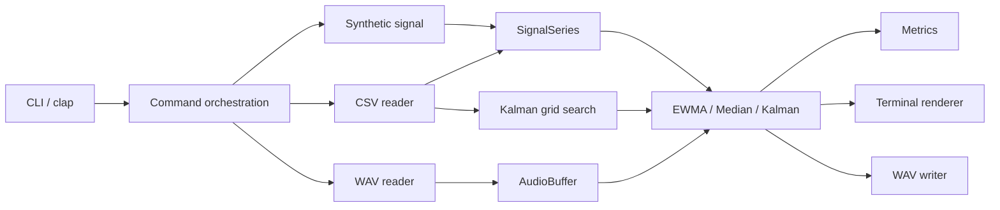
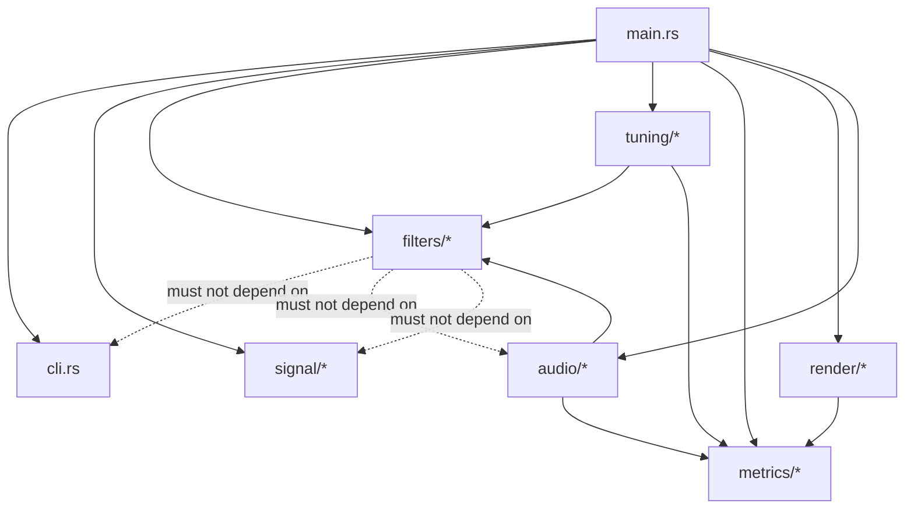
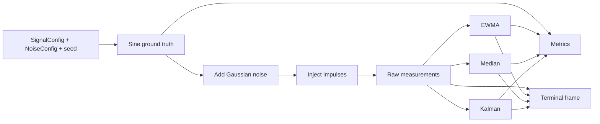
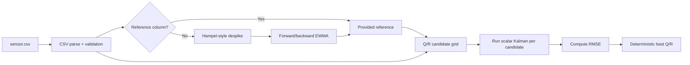
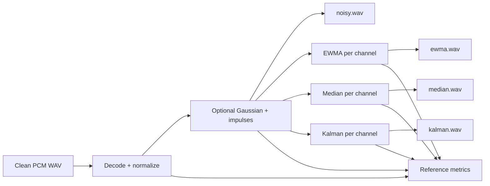

# 02 — Architecture

## Top-level flow



## Core dependency direction



The dotted arrows represent forbidden reverse coupling.

## Core data model

Suggested structs:

```rust
pub struct SignalSeries {
    pub time: Option<Vec<f64>>,
    pub values: Vec<f64>,
    pub reference: Option<Vec<f64>>,
}

pub struct SyntheticSeries {
    pub time: Vec<f64>,
    pub truth: Vec<f64>,
    pub noisy: Vec<f64>,
    pub spike_mask: Vec<bool>,
}

pub struct FilterOutputs {
    pub raw: Vec<f64>,
    pub ewma: Vec<f64>,
    pub median: Vec<f64>,
    pub kalman: Vec<f64>,
}
```

Keep these domain types simple. Avoid a generic framework unless a later phase proves it is needed.

## Synthetic pipeline



## CSV tuning pipeline



## Audio pipeline



## Startup and state

Every command should construct fresh filters. No filter state should leak between channels, files, traces, tuning candidates, or repeated commands.
